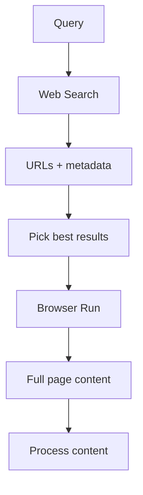

Web Search is a discovery API. It takes a query and returns a list of URLs that match, along with metadata like titles and descriptions. It does not return page content.

This design is intentional. Discovery and content retrieval are separate steps, which gives you full control over what you fetch and how you process it.

## The search-then-fetch workflow

A typical workflow with Web Search has two steps:

1. Search (Web Search): find relevant URLs for a query
2. Fetch ([Browser Run](/browser-run/)): get the content of the pages you want

For example, an agent researching a topic would:

1. Search for "topic" to get back a list of relevant URLs and metadata
2. Evaluate the returned titles and descriptions to decide which pages are worth reading
3. Fetch content from selected URLs using [Browser Run](/browser-run/) for rendered HTML, markdown, structured data, or screenshots
4. Process the content with an LLM or extract specific data

This composable approach means you choose the right tool for content retrieval. Use [Browser Run /markdown](/browser-run/quick-actions/markdown-endpoint/) for clean text, [/json](/browser-run/quick-actions/json-endpoint/) for structured extraction, or [/screenshot](/browser-run/quick-actions/screenshot-endpoint/) for visual captures.

## What is in a search result

Each result contains metadata about the page. Guaranteed fields include `url` and `title`. Optional fields include description, image, favicon, and last modified date, which depend on what metadata the indexed page exposes. Web Search does not return page content.

This metadata is enough for an agent to assess relevance and decide which pages to fetch. Refer to [Result fields](/web-search/get-started/#result-fields) for the full schema.

## Web Search vs AI Search

Web Search and [AI Search](/ai-search/) serve different purposes:

| Aspect               | Web Search                                  | AI Search                                  |
| -------------------- | ------------------------------------------- | ------------------------------------------ |
| **What it searches** | The public web                              | Specific content you define                |
| **Setup**            | Add a binding or call the REST API          | Create an instance, then index your content |
| **Use case**         | Find information on the open internet       | Retrieval over specific content you define |
| **Content**          | Returns URLs (you fetch content separately) | Returns indexed content directly           |

Use Web Search when your agent needs real-time information from across the web. Use AI Search when you need retrieval over specific content you define.
